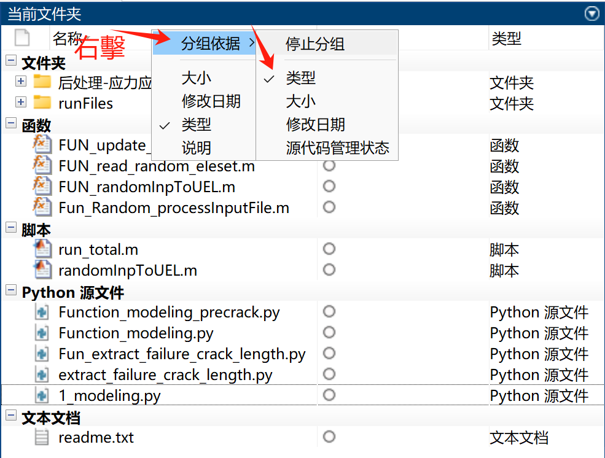

# Useful settings for common-utilized software

## 1. MATLAB
- **如何在處理文件時使文件排列的一目瞭然?**
  1. 按文件類型排序
  2. 使用分組功能，按類型分組
  
## 2. Polacode制作代码截图
- **如何优雅的将各种代码截图到ppt或其他展示平台中？
  1. 打开vscode
  2. 安装Polacode插件
  3. 在search栏中输入 >Polacode
  4. 弹出相应的界面，然后将想要的code复制，粘贴到这个界面
## 3. 在vscode中运行latex,textlive
- **如何利用vscode环境运行tex文件，同时便于使用AI工具？
  1. 在vscode中改写setting, 设置模板如下：
```
    {
      {
      "latex-workshop.latex.tools": [
        {
          "name": "pdflatex",
          "command": "pdflatex",
          "args": [
            "-synctex=1",
            "-interaction=nonstopmode",
            "-file-line-error",
            "%DOC%"
          ]
        },
        {
          "name": "xelatex",
          "command": "xelatex",
          "args": [
            "-synctex=1",
            "-interaction=nonstopmode",
            "-file-line-error",
            "%DOC%"
          ]
        },
        {
          "name": "bibtex",
          "command": "bibtex",
          "args": [
            "%DOCFILE%"
          ]
        }
      ],
    
    
      "latex-workshop.latex.recipes": [
        {
          "name": "pdflatex",
          "tools": [
            "pdflatex"
          ]
        },
        {
          "name": "xelatex",
          "tools": [
            "xelatex"
          ]
        },
        {
          "name": "xe->bib->xe->xe",
          "tools": [
            "xelatex",
            "bibtex",
            "xelatex",
            "xelatex"
          ]
        },
        {
          "name": "pdflatex -> bibtex -> pdflatex*2",
          "tools": [
            "pdflatex",
            "bibtex",
            "pdflatex",
            "pdflatex"
          ]
        }
      ],
    
      
      "latex-workshop.latex.autoBuild.run": "never",
      "latex-workshop.synctex.afterBuild.enabled": true,
    
      "latex-workshop.view.pdf.viewer": "external",
      "latex-workshop.view.pdf.external.viewer.command": "D:/2 software/25 sumatraPDF/SumatraPDF/SumatraPDF.exe",
    
      "latex-workshop.view.pdf.external.synctex.command": "D:/2 software/25 sumatraPDF/SumatraPDF/SumatraPDF.exe",
      "latex-workshop.view.pdf.external.synctex.args": [
        "-forward-search",
        "%TEX%",
        "%LINE%",
        "-reuse-instance",
        "-inverse-search",
        "\"D:/2 software/13 VScode/Microsoft VS/CodeCode.exe\" -g \"%f:%l\"",
        "%PDF%"
      ],
      "latex-workshop.view.pdf.internal.synctex.keybinding": "double-click"
    }
      //------------------------------LaTeX 配置----------------------------------
      "latex-workshop.latex.tools": [
        {
          "name": "xelatex",
          "command": "xelatex",
          "args": [
            "-synctex=1",
            "-interaction=nonstopmode",
            "-file-line-error",
            "%DOC%"
          ]
        }
      ],
      "latex-workshop.latex.recipes": [
        {
          "name": "xelatex",
          "tools": ["xelatex"]
        }
      ],
      "latex-workshop.latex.autoBuild.run": "onFileChange",
    
      //------------------------------PDF 阅读器配置----------------------------------
      "latex-workshop.view.pdf.viewer": "external",
      "latex-workshop.view.pdf.ref.viewer": "external",
      "latex-workshop.view.pdf.external.viewer.command": "D:/2 software/25 sumatraPDF/SumatraPDF.exe",
      "latex-workshop.view.pdf.external.viewer.args": [
        "%PDF%"
      ],
      "latex-workshop.view.pdf.external.synctex.command": "D:/2 software/25 sumatraPDF/SumatraPDF.exe",
      "latex-workshop.view.pdf.external.synctex.args": [
        "-forward-search",
        "%TEX%",
        "%LINE%",
        "%PDF%"
      ]
    ```

